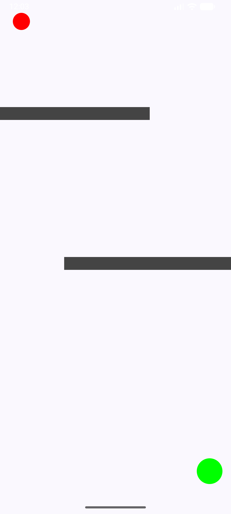

# Q1: Gyroscope-Controlled Ball Game

## 1. Description
This application is a physics-based maze game developed in **Kotlin** using **Jetpack Compose**. The app demonstrates hardware integration by utilizing the device's internal sensors to create an interactive gameplay experience.

### Key Features & Requirements
* **Gyroscope Integration**: Uses the `Sensor.TYPE_GYROSCOPE` to detect real-time angular velocity (tilt) from the device.
* **Dynamic Ball Movement**: Translates tilt data into acceleration and velocity for the red circle (ball), creating a natural "rolling" feel rather than static teleportation.
* **Maze Obstacles**: Implements custom `Rect` objects as physical barriers that the ball cannot pass through.
* **Canvas Rendering**: The entire game UI is rendered using a low-level `Canvas` for optimized performance and fluid movement.
* **Collision Engine**: Features a sub-stepping collision detection algorithm that breaks frame movement into 5 smaller segments per frame to prevent "clipping" through obstacles at high speeds.

---

## 2. Running the App
The goal of the game is to tilt your phone to guide the **Red Ball** past the **Dark Gray Obstacles** and reach the **Green Goal** located at the bottom right of the screen.

### Gameplay Screenshot

---

## 3. Technical Specifications
This app was developed and tested using the following environment:

* **Development Platform**: Android Studio
* **Minimum SDK**: 26 (Android 8.0 Oreo)
* **Target/Compile SDK**: 36
* **Language**: Kotlin 1.9+ with Jetpack Compose
* **Device Used**: Physical Android Device (Recommended for Gyroscope testing) or Emulator with Sensor Simulation

---

## 4. Physics Implementation Details
To provide a smooth user experience, the app utilizes:
1. **Acceleration**: Tilt values directly increase velocity rather than position.
2. **Friction**: A 0.92 friction coefficient is applied every frame to simulate drag and allow for precise stopping.
3. **Sub-stepping**: Movement is calculated in 5 mini-steps per sensor update to ensure the collision engine accurately detects wall boundaries.

## 5. AI disclosure 
I used Gemini to help me translate my knowledge of rectanges/collision checking in PyGame to Kotlin, which was extremely helpful. It also helped me remember to split up the movements so things wouldn't "glitch" through walls. In addition, it helped me verify I had met the requirements, format a few comments, and draft this README!
